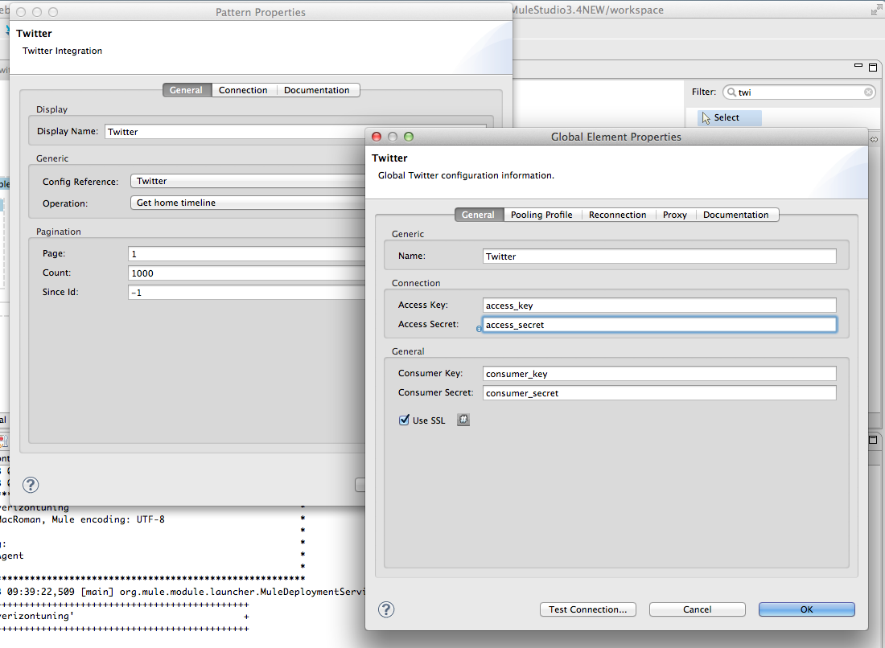
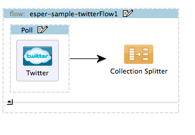
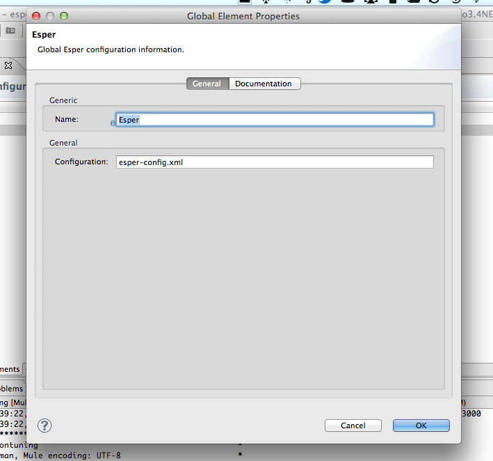
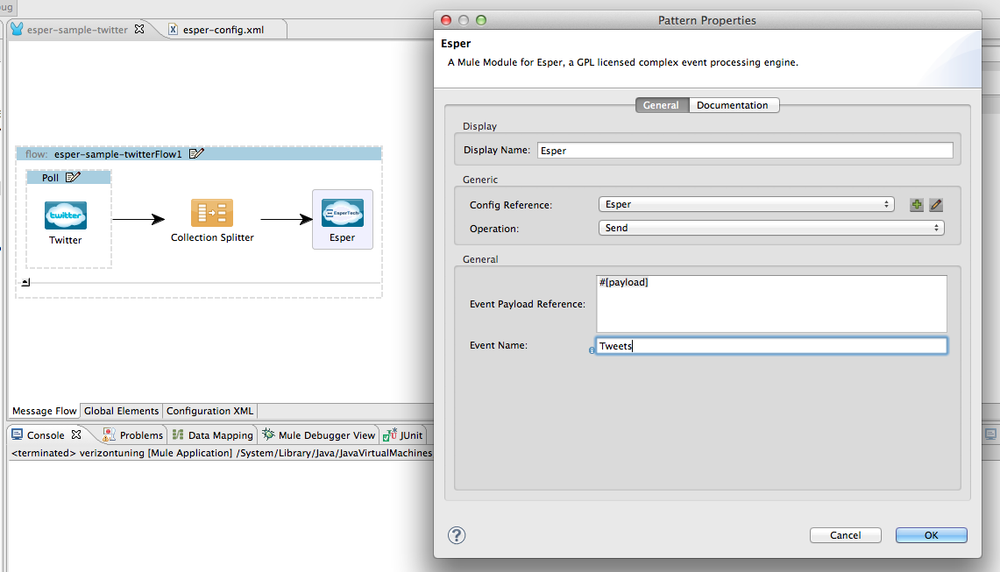
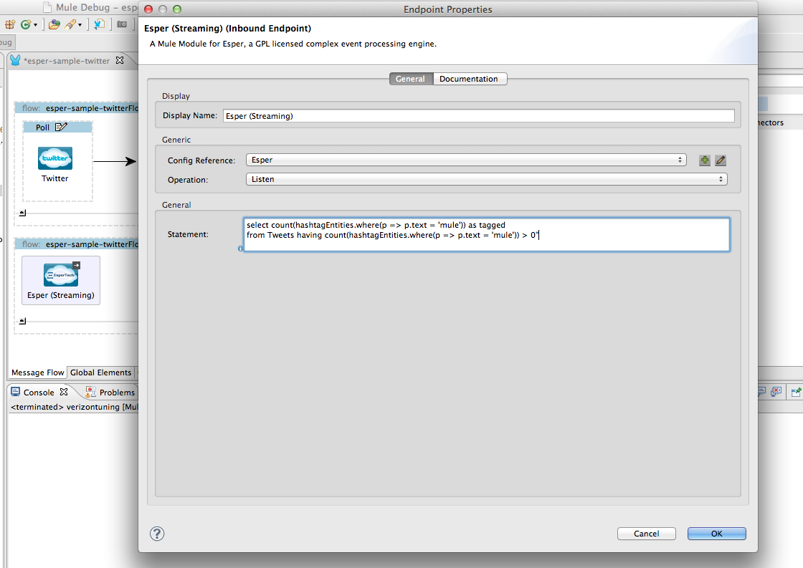
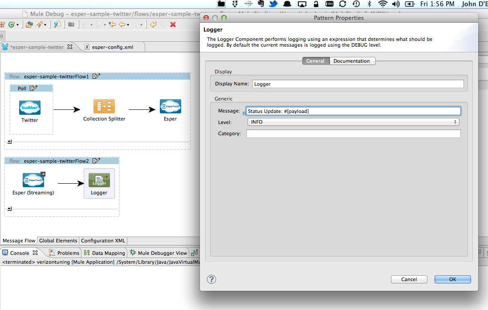

**Mule Sample: Complex Event Processing with Esper**
======================================================

Purpose
=======

In this sample, I'll show how to build a simple application with Mule that uses Esper to listen for Tweets with a particular hashtag.

Prerequisites
=============

In order to build and run this project you'll need
 

●     A consumer key and secret to access Twitter's API.

●     To have downloaded and installed [Mule Studio Community edition](http://www.mulesoft.org/download-mule-esb-community-edition) on your computer

**Getting Mule Studio Ready**

If you haven't installed Mule Studio on your computer yet, it's time to download Mule Studio from this location: [http://www.mulesoft.org/download-mule-esb-community-edition](http://www.mulesoft.org/download-mule-esb-community-edition). You also have the option of downloading a 30 day trial of Mule Enterprise Edition from this location [http://www.mulesoft.com/mule-esb-enterprise](http://www.mulesoft.com/mule-esb-enterprise) if you want to evaluate and purchase the premium edition. This demo can be built using either community or enterprise edition. There is no specific installation that you need to run. Once you unzip the zip file to your desired location, you are ready to go. To install the Esper Module, you can download and install it from MuleStudio Cloud Connectors Update Site. To do that:

1. Open Mule Studio and from "Help" menu select "Install New Software...". Installation dialog box opens.

2. From "Work with" drop down, select "MuleStudio Cloud Connectors Update Site". The list of available connectors will be shown to you.

3. Find and select the Esper module in the list of available modules, the tree structure that is shown. A faster way to find a specific connector is to filter the list by typing the name of the connector in the input box above the list. You can choose more than one connector to be installed at once.

4. When you are done selecting the connectors to be installed, click on "Next" button. Details of each connector are shown on the next page. Click on "Next" button again and accept the terms of the license agreement.

5. Click on "Finish" button. The connector is downloaded and installed onto Studio. You'll need to restart the Studio for the installation to be completed.
  
  
**Setting up the project**

Now that you've got your Mule Studio up and running, it's time to work on the Mule App. Create a new Mule Project by clicking on "File \> New \> Mule Project". In the new project dialog box, the only thing you are required to enter is the name of the project. You can click on "Next" to go through the rest of pages.

**Building the Event insertion flow**

We'll now build a flow to consume status updates from Twitter's public timeline and insert them into an event stream.  Let's start off by configuring Mule to poll the timeline once a minute, as demonstrated below.

We'll configure the Twitter Connector's operation to "Get home timeline" and tell it pull 1000 status updates.  We also need to add a Twitter Configuration Reference which we can accomplish by clicking on the "Plus" icon and setting the details of our Twitter API account.

Once this is done we'll use a collection-splitter to split the collection of status updates into individual elements.   

Now let's configure Esper to accept the status updates as events.  First we need  to create a configuration file for Esper.  We'll create a file called "esper-config.xml" in the project's src/main/resources folder and edit it to look like this:

	<esper-configuration xmlns:xsi="http://www.w3.org/2001/XMLSchema-instance"
                     xmlns="http://www.espertech.com/schema/esper"
                     xsi:schemaLocation="
                http://www.espertech.com/schema/esper
                http://www.espertech.com/schema/esper/esper-configuration-2.0.xsd">

    <event-type name="Tweets" class="twitter4j.StatusJSONImpl"/>

	</esper-configuration>
	
This will configure an event stream called "Tweets" that will have events of type twitter4j.StatusJSONImpl.  

Now we'll configure the Esper connector in Mule Studio by selecting "Global Elements" Tab, then clicking on "Create".  Once we're in this window we can type "Esper" in the filter box and select Esper under Cloud Connectors. We can then set the path to the configuration XML we just created under "Configuration".

We can now go back to the "Message Flow" tab and drag the "Esper" icon from the palette after the collection-splitter.  After double clicking on it we set the Config Reference to "Esper" and select "Send" as the Operation.  We can then configure the Event Payload Reference to be the payload of the message, which in this case will be an instance of twigger4j.StatusJSONImpl.  The Event Name is set to "Tweets", correllating to the "Tweets" event-type name we defined in esper-config.xml.

**Building the event listener flow**

At this point we have a flow that will poll Twitter once a minute and insert status updates into an Esper event stream called "Tweets."  Now let's look at how we can use EPL, Esper's query language, to select interesting events from this stream.  We'll start off by creating a new flow by dragging an Esper processor from the palette onto the canvas.  We'll double click on it and configure it identically to the Esper message processor above except we will chose "Listen" as the operation.

For the purposes of this sample we'll construct an EPL query that will only select status updates that contain a "mule" hashtag.  You can see this in the screen shot below.

We'll wrap up by adding a logger message processor to output these status updates to the console.

**Flow XML**

The final flow XML should look like this. 

    <?xml version="1.0" encoding="UTF-8"?>

    <mule xmlns:esper="http://www.mulesoft.org/schema/mule/esper"     xmlns:twitter="http://www.mulesoft.org/schema/mule/twitter" xmlns="http://www.mulesoft.org/schema/mule/core" xmlns:doc="http://www.mulesoft.org/schema/mule/documentation" xmlns:spring="http://www.springframework.org/schema/beans" version="EE-3.4.0" xmlns:xsi="http://www.w3.org/2001/XMLSchema-instance" xsi:schemaLocation="http://www.springframework.org/schema/beans http://www.springframework.org/schema/beans/spring-beans-current.xsd
	http://www.mulesoft.org/schema/mule/core http://www.mulesoft.org/schema/mule/core/current/mule.xsd
	http://www.mulesoft.org/schema/mule/twitter http://www.mulesoft.org/schema/mule/twitter/2.4/mule-twitter.xsd
	http://www.mulesoft.org/schema/mule/esper http://www.mulesoft.org/schema/mule/esper/1.0/mule-esper.xsd">
    	<twitter:config name="Twitter" accessKey="access_key" accessSecret="access_secret" consumerKey="consumer_key" consumerSecret="consumer_secret" doc:name="Twitter">
        	<twitter:connection-pooling-profile initialisationPolicy="INITIALISE_ONE" exhaustedAction="WHEN_EXHAUSTED_GROW"/>
	    </twitter:config>
    	<esper:config name="Esper" configuration="esper-config.xml" doc:name="Esper"/>
	    <flow name="esper-sample-twitterFlow1" doc:name="esper-sample-twitterFlow1">
    	    <poll frequency="1000" doc:name="Poll">
        	    <twitter:get-home-timeline config-ref="Twitter"      doc:name="Twitter" count="1000"/>
	        </poll>
    	    <collection-splitter doc:name="Collection Splitter"/>
        	<esper:send config-ref="Esper" eventPayload-ref="#[payload]" 	eventName="Tweets" doc:name="Esper"/>
	    </flow>
    	<flow name="esper-sample-twitterFlow2" doc:name="esper-sample-twitterFlow2">
        	<esper:listen config-ref="Esper" statement="select count(hashtagEntities.where(p =&gt; p.text = 'mule')) as tagged
	from Tweets having count(hashtagEntities.where(p =&gt; p.text = 'mule')) &gt; 0&quot;" doc:name="Esper (Streaming)"/>
    	    <logger message="Status Update: #[payload]" level="INFO" 	doc:name="Logger"/>
	    </flow>
	</mule>

**Testing the app**

Now it's time to test the app. Run the app in Mule Studio and Tweets with matching hashtags should appear in the console window.

Other resources
===============

For more information on:

●    Esper connector, please visit [http://www.mulesoft.org/extensions/amazon-sqs](http://www.mulesoft.org/extensions/esper)   
●     Mule platform and how to build Mule apps, please visit  [http://www.mulesoft.org/documentation](http://www.mulesoft.org/documentation/display/current/Home)
